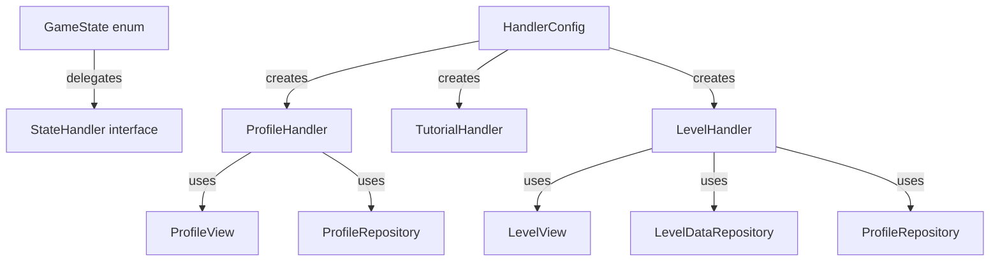

# Dependency Injection 처리에 대해

지금까지의 우테코 미션과 달리 이번 stream lab은 외부 입력이 많았다. 대표적으로

* 프로필 정보 입력
* 사용자의 구현 코드 테스트를 위한 테스트 json 로딩
* 사용자가 구현한 Java 파일을 읽어온 후 정적 분석
* 다양한 view 유형: `TutorialView`, `MainView`, `LevelView`

테스트가 쉬운 코드를 위해서는 이들의 mocking이 가능해야 했고 이를 컨트롤러에 의존성 주입으로 해결하려 했다. 하지만 controller에 이러한 객체를 전부 몰기엔 필드가 너무 비대해졌고 핵심인 `run()`의 동작이 잘 드러나지 않았다.   

```java
public class TutorialController {
    private TutorialConsoleView view;
    private WelcomeView welcomeView;
    private RuleExplanationView ruleView;
    private ExampleView exampleView;
    private ProblemView problemView;
    private FeedbackView feedbackView;

    private FileManager fileManager;
    private FileWatcher fileWatcher;
    private ASTAnalyzer astAnalyzer;
    private RuleChecker ruleChecker;
    private TestRunner testRunner;
    private ProfileManager profileManager;
    private AchievementSystem achievementSystem;
    
    // 다량의 의존성
}
```
## 1차 해결 시도안: GameContext 도입

런타임에 공유되어야 하는 상태(FileWatcher, Observer 등)를 GameContext로 분리:

```java
public class GameContext {
    private final FileWatcher fileWatcher;
    private final GradingView gradingView;
    private GraderObserver currentObserver;
}
```

**문제점**: Context가 점점 비대해지고, Profile 같은 도메인 데이터까지 Context에 넣으려는 유혹 발생.

---

## 2차 해결: State + Handler 패턴

**핵심 아이디어**: 상태(State)와 로직(Handler)을 분리.

```java
public enum GameState {
    INTRO(HandlerConfig.createIntroHandler()),
    PROFILE(HandlerConfig.createProfileHandler()),
    // ...
    private final StateHandler handler;

    public GameState handle() {
        return handler.handle();  // 다음 상태 반환
    }
}
```

각 Handler는 **자신의 상태에 필요한 의존성만** 주입받음:

```java
public class LevelHandler implements StateHandler {
    private final LevelView view;
    private final LevelDataRepository levelDataRepository;
    private final ProfileRepository profileRepository;
}
```

---

## 3차 해결: 팩토리로 생성 책임 분리

HandlerConfig가 Handler 생성과 의존성 조립 담당:

```java
public static LevelHandler createLevelHandler() {
    return new LevelHandler(
        new LevelConsoleView(),
        new LevelDataRepository(),
        new ProfileRepository()
    );
}
```

---

## 최종 구조



---

## 적용된 원칙

| 원칙 | 적용 |
|------|------|
| SRP | Handler는 한 상태의 로직만 담당 |
| OCP | 새 상태 추가 시 기존 코드 수정 없이 Handler 추가 |
| DIP | Handler는 인터페이스(View, Repository)에 의존 |

---

## 결론

**Before**: Controller 하나에 모든 의존성 집중

**After**:
- State 패턴으로 상태 전이 명확화
- Handler로 상태별 로직 분리
- Factory로 생성 책임 분리
- Interface로 구현체 교체 용이

> 의존성이 많다면, **책임을 분리**해서 각자 필요한 의존성만 갖도록.
