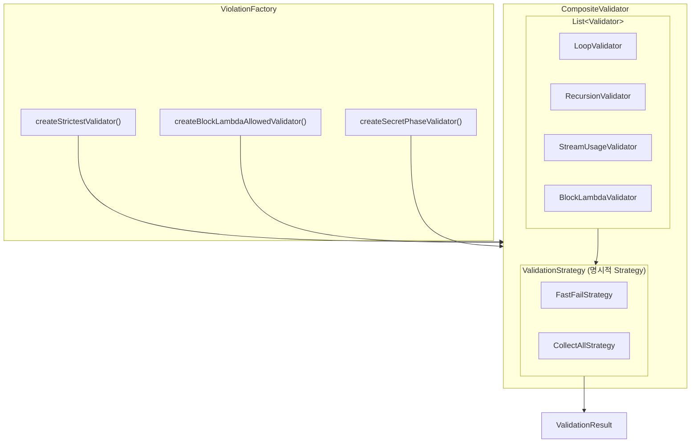
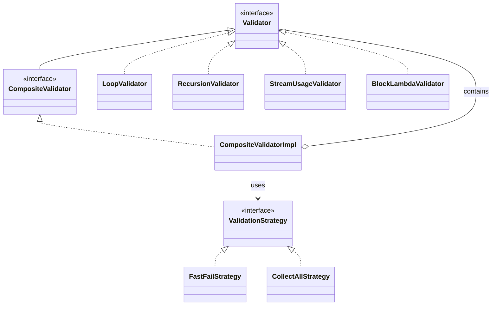

# 도전 및 연구: Composite + Strategy 패턴을 활용한 코드 채점기 설계

Stream Lab의 핵심 기능 중 하나는 사용자가 작성한 코드가 "Stream API 규칙"을 준수하는지 검증하는 것이다. 단순히 정답 여부만 체크하는 것이 아니라, 코드의 **구조적 제약**을 검사해야 한다.

## 문제 상황

레벨별로 적용되는 코드 제약이 다르다:

| 레벨 | 제약 조건 |
|------|-----------|
| Tutorial ~ Level 3 | for/while 금지, 재귀 금지, Stream 필수, 블록 람다 금지 |
| Level 4 ~ 5 | for/while 금지, 재귀 금지, Stream 필수 (블록 람다 허용) |
| Secret Phase | for/while 금지, 재귀 금지만 (Stream 선택) |

또한 검증 실패 시 피드백 방식도 다를 수 있다:
- **Fast-Fail**: 첫 번째 위반 발견 즉시 중단 (빠른 피드백)
- **Collect-All**: 모든 위반 수집 후 한번에 표시 (상세 피드백)

이를 **하드코딩 없이 유연하게 조합**할 수 있는 구조가 필요했다.

## 해결: Composite + Strategy 패턴 조합

### 1. Validator 인터페이스 (Component)

각 검증 규칙을 독립적인 Validator로 분리했다.

```java
public interface Validator {
    ValidationResult validate(AnalysisContext context);
}
```

개별 Validator 구현:
- `LoopValidator` - for/while/do-while 사용 감지
- `RecursionValidator` - 재귀 호출 감지
- `StreamUsageValidator` - Stream API 사용 여부
- `BlockLambdaValidator` - 블록 람다 `{ }` 사용 감지
- `SingleStatementValidator` - 단일 return문 강제
- `NoVariableDeclarationValidator` - 변수 선언 금지
- `HelperMethodValidator` - 헬퍼 메서드 개수 제한

### 2. CompositeValidator (Composite)

여러 Validator를 하나로 묶어 관리한다.

```java
public interface CompositeValidator extends Validator {
    CompositeValidator add(Validator validator);
    CompositeValidator remove(Validator validator);
}

public class CompositeValidatorImpl implements CompositeValidator {
    private final List<Validator> validators;
    private final ValidationStrategy strategy;

    @Override
    public ValidationResult validate(AnalysisContext context) {
        List<ValidationResult> results = validators.stream()
                .map(v -> v.validate(context))
                .toList();

        return strategy.aggregate(results);  // Strategy에 위임
    }
}
```

### 3. ValidationStrategy (Strategy) - 결과 집계 전략

검증 결과를 어떻게 집계할지 전략으로 분리했다.

```java
public interface ValidationStrategy {
    ValidationResult aggregate(List<ValidationResult> results);
}
```

**FastFailStrategy** - 첫 위반 발견 시 즉시 반환:
```java
public class FastFailStrategy implements ValidationStrategy {
    @Override
    public ValidationResult aggregate(List<ValidationResult> results) {
        return results.stream()
                .filter(r -> r instanceof ValidationResult.Violation)
                .findFirst()
                .orElse(ValidationResult.ok());
    }
}
```

**CollectAllStrategy** - 모든 위반 수집:
```java
public class CollectAllStrategy implements ValidationStrategy {
    @Override
    public ValidationResult aggregate(List<ValidationResult> results) {
        List<ValidationResult.Violation> violations = results.stream()
                .filter(r -> r instanceof ValidationResult.Violation)
                .map(r -> (ValidationResult.Violation) r)
                .toList();

        if (violations.isEmpty()) {
            return ValidationResult.ok();
        }
        return ValidationResult.multipleViolations(violations);
    }
}
```

### 4. Factory를 통한 Validator 조합 선택 (넓은 의미의 Strategy)

레벨별로 어떤 Validator 조합을 사용할지 Factory 메서드로 캡슐화했다. 이는 엄밀히 말하면 **Factory Method 패턴**이지만, "레벨에 따라 다른 검증 전략을 선택한다"는 관점에서 **넓은 의미의 Strategy**로도 볼 수 있다.

```java
public class ViolationFactory {
    // Tutorial ~ Level 3: 가장 엄격한 제약
    public static CompositeValidator createStrictestValidator() {
        return new CompositeValidatorImpl(new CollectAllStrategy())
                .add(new LoopValidator())
                .add(new RecursionValidator())
                .add(new StreamUsageValidator())
                .add(new BlockLambdaValidator());
    }

    // Level 4 ~ 5: 블록 람다 허용
    public static CompositeValidator createBlockLambdaAllowedValidator() {
        return new CompositeValidatorImpl(new CollectAllStrategy())
                .add(new LoopValidator())
                .add(new RecursionValidator())
                .add(new StreamUsageValidator());
    }

    // Secret Phase: 최소 제약
    public static CompositeValidator createSecretPhaseValidator() {
        return new CompositeValidatorImpl(new CollectAllStrategy())
                .add(new LoopValidator())
                .add(new RecursionValidator());
    }
}
```

#### Factory vs Strategy 구분

| 관점 | Factory Method | Strategy |
|------|----------------|----------|
| 초점 | 객체 **생성** 캡슐화 | 알고리즘 **교체** |
| 현재 적용 | `ViolationFactory.createXxxValidator()` | `ValidationStrategy` (FastFail, CollectAll) |

현재 구조에서 Strategy 패턴이 적용된 곳은 두 군데다:
1. **명시적 Strategy**: `ValidationStrategy` 인터페이스 (결과 집계 방식)
2. **암묵적 Strategy**: Factory를 통한 Validator 조합 선택 (레벨별 제약 구성)

## 구조 다이어그램





## 이 설계의 장점

### 1. 개방-폐쇄 원칙 (OCP) 준수
새로운 검증 규칙 추가 시 기존 코드 수정 없이 새 Validator 클래스만 추가하면 된다.

```java
// 새 규칙 추가: 기존 코드 변경 없음
public class NewRuleValidator implements Validator { ... }

validator.add(new NewRuleValidator());
```

### 2. 단일 책임 원칙 (SRP) 준수
각 Validator는 하나의 검증 규칙만 담당한다. 테스트와 유지보수가 용이하다.

### 3. 두 축의 유연성 확보
- **무엇을 검증할지**: Composite로 Validator 조합
- **어떻게 집계할지**: Strategy로 결과 처리 방식 선택

```java
// 같은 Validator 조합, 다른 피드백 방식
new CompositeValidatorImpl(new FastFailStrategy())    // 초보자: 하나씩
new CompositeValidatorImpl(new CollectAllStrategy())  // 숙련자: 한번에
```

### 4. 런타임 동적 변경 가능
```java
CompositeValidator validator = createStrictestValidator();

if (userWantsHint) {
    validator.remove(blockLambdaValidator);  // 힌트 모드
}
```

## 배운 점

1. **패턴은 조합해서 쓸 때 더 강력하다**: Composite 단독으로는 "무엇을"만, Strategy 단독으로는 "어떻게"만 유연해진다. 둘을 조합하니 두 축 모두에서 유연성을 확보했다.

2. **Factory와 Strategy의 경계**: 엄밀히 다른 패턴이지만, "선택"이라는 관점에서 Factory도 넓은 의미의 Strategy로 해석할 수 있다. 중요한 건 패턴 이름보다 **의도와 유연성**이다.

3. **Sealed Interface와의 시너지**: `ValidationResult`를 sealed interface로 설계해서 `Ok`, `Violation`, `MultipleViolations` 세 가지 상태만 허용했다. 패턴 매칭과 함께 사용하니 타입 안전성이 높아졌다.

4. **테스트 용이성**: 각 Validator가 독립적이라 단위 테스트 작성이 쉬웠다. JavaParser로 코드 스니펫을 파싱해서 테스트하는 헬퍼를 만들어 37개 테스트 케이스를 빠르게 작성했다.
