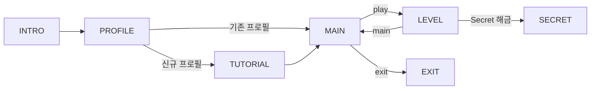

# Stream Lab 기획 프로그레스

> 2025-11-22 기준 논의된 기획 내용 정리

---

## 1. 상태 흐름 (FSA)



### Profile 상태
- 신규 사용자: 이름 입력 → 튜토리얼 스킵 여부 선택
- 기존 사용자: 바로 MAIN으로 직행
- `data/profile.json`에 저장

### Profile 데이터 구조
```json
{
  "userName": "사용자이름",
  "tutorialSkipped": false,
  "levelDialogueShown": {"level1": true, "level2": false},
  "passedLevels": [1],
  "currentLevel": 2,
  "secretUnlocked": false
}
```

---

## 2. Level 시스템

### 레벨 진입 흐름
1. MAIN에서 `play` 커맨드
2. `currentLevel` 확인, passed된 레벨은 스킵
3. 첫 방문 시 진행자 dialogue 출력 (이후 출력 안 함)
4. 학습 목표 표시
5. 문제 목록 출력 (JSON에서 로드)
6. 파일 감시 대기

### 레벨 진행 중 커맨드
- `열기` / `open`: 학습 목표 다시 보기
- `m` / `main`: 메인 메뉴로 복귀

### 레벨별 학습 목표

| Level | 주제 | 핵심 메서드 |
|-------|------|-------------|
| 1 | 기본 연산 | filter, map, collect, sorted, limit, distinct |
| 2 | 중급 메서드 | flatMap, skip, groupingBy, averagingInt |
| 3 | Collectors 심화 | 중첩 groupingBy, partitioningBy, toMap |
| 4 | 고급 문제 | 복합 연산, 커스텀 Comparator |
| 5 | Expert | 커스텀 Collector, 알고리즘 문제 |

---

## 3. Secret Phase 진입 시스템

### 컨셉
- **Bomb Lab 감성**: 숨겨진 힌트를 발견해야 진입 가능
- 각 단계 완료 시 "시스템 코드" (hex 값) 출력
- 7개 hex를 모아 디코딩하면 진입 방법 힌트

### Hex 힌트 시스템

| 단계 | Hex 코드 | 디코딩 |
|------|----------|--------|
| INTRO | `0x646F4E6F` | "doNo" |
| TUTORIAL | `0x74546F75` | "tTou" |
| Level 1 | `0x63682D3E` | "ch->" |
| Level 2 | `0x66696228` | "fib(" |
| Level 3 | `0x37295B31` | "7)[1" |
| Level 4 | `0x2C312C32` | ",1,2" |
| Level 5 | `0x2C332C355D` | ",3,5]" |

**조합 결과**: `doNotTouch->fib(7)[1,1,2,3,5]`

### 해금 조건
Level5 인터페이스의 숨겨진 메서드:

```java
// 시스템 유지보수용 - 건드리지 마세요
default List<Integer> doNotTouch() {
    return List.of();
}
```

피보나치 수열 7항 `List.of(1, 1, 2, 3, 5, 8, 13)` 반환 시 Secret Phase 해금

### 해금 시 연출
```
██████████████████████████████████████
█                                    █
█   ░░░ HIDDEN SEQUENCE DETECTED ░░░ █
█                                    █
██████████████████████████████████████

🔓 Secret Phase 해금
```

---

## 4. 테스트 데이터 구조

### 위치
```
data/test-data/
├── tutorial/tutorial.json
├── level1/level1.json
├── level2/level2.json
└── ...
```

### JSON 구조
```json
{
  "level": 1,
  "masterData": {
    "students": [...],
    "products": [...],
    "characters": [...],
    "items": [...],
    "guilds": [...]
  },
  "problems": [
    {
      "id": "1-1-1",
      "name": "문제 이름",
      "description": "문제 설명",
      "methodName": "메서드명",
      "inputType": "students",
      "outputType": "List<String>",
      "testCases": [...]
    }
  ]
}
```

---

## 5. 아키텍처 결정사항

### State + Handler 패턴
- `GameState` enum: 상태 정의 및 전이
- `StateHandler` interface: 각 상태별 로직
- `HandlerConfig`: 팩토리로 Handler 생성

### 의존성 분리
- Handler는 필요한 의존성만 주입받음
- Profile과 GameContext 독립 유지
- Repository 패턴으로 데이터 접근 분리

### ValidationResult 설계
- `sealed interface` + `record`로 타입 안전성 확보
- Haskell Either Monad 패턴 적용
- Railway Oriented Programming 지원

---

## 6. 미구현 항목

### 핵심 기능
- [ ] LevelGraderObserver (Level용 채점)
- [ ] 레벨 완료 판정 로직
- [ ] MainHandler 프로필 연동 (Mock 제거)
- [ ] Secret Phase 전체

### 부가 기능
- [ ] 업적 시스템
- [ ] 힌트 시스템
- [ ] 점수/보너스 계산
- [ ] 시작 시 기존 코드 스캔

### 예외 처리
- [ ] 이름 20자 초과 검증
- [ ] 파일 파싱 실패 처리
- [ ] 컴파일 에러 처리

---

## 7. 문서 목록

| 문서 | 설명 |
|------|------|
| `docs/기능명세.md` | 전체 기능 체크리스트 |
| `docs/기획-프로그레스.md` | 기획 논의 내용 (본 문서) |
| `docs/study/2025-11-22-ValidationResult-설계.md` | sealed+record 설계 이유 |
| `docs/study/2025-11-13-의존성-주입-문제-해결.md` | DI 문제 해결 과정 |
